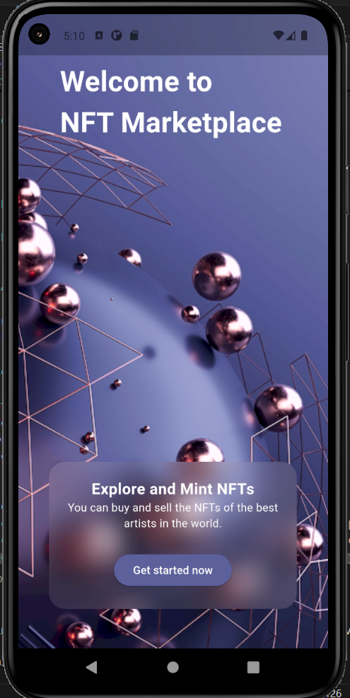
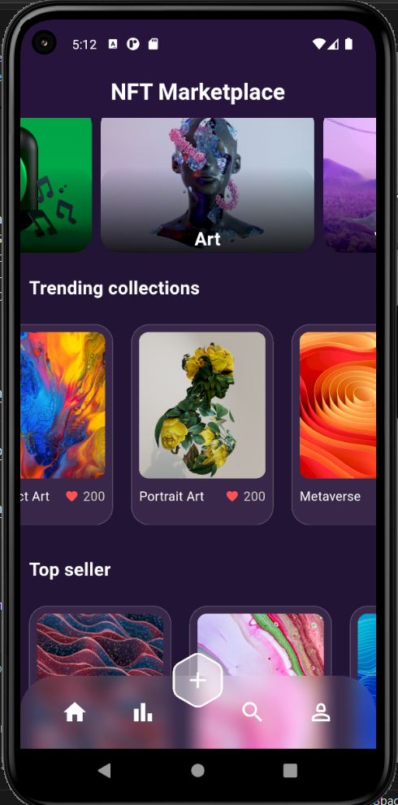
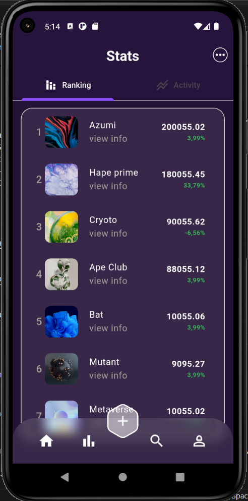

# NFT Marketplace Flutter App

A modern, responsive NFT marketplace UI built with Flutter. This project demonstrates clean UI design, modular widget structure, and basic state management for a digital collectibles platform.

## Features

- **Onboarding Page:** Welcome users with an introduction and guide them through the app’s main features.
- **Home & Stats Pages:** Switch between main marketplace and statistics views.
- **Custom Bottom Navigation Bar:** Easy navigation between pages.
- **Modern UI Elements:** Glassmorphism effects, rounded corners, and custom dropdowns.
- **Responsive Design:** Layout adapts to different screen sizes.
- **NFT List:** Showcases NFT items with images, rankings, prices, and percentage changes.
- **Clean Code Structure:** Modular widgets for easy maintenance and scalability.

## Getting Started

1. **Clone the repository:**
   ```bash
   git clone https://github.com/yourusername/nft_flutter_app.git
   cd nft_flutter_app
   ```

2. **Install dependencies:**
   ```bash
   flutter pub get
   ```

3. **Run the app:**
   ```bash
   flutter run
   ```

## Folder Structure

- `lib/`
  - `onboarding.dart` – Onboarding introduction screens.
  - `homepage.dart` – Main navigation and app bar logic.
  - `statepage.dart` – Stats page with NFT ranking/activity.
  - `item.dart` – Widget for displaying individual NFT items.
  - `dropbottons.dart` – Custom dropdown button widgets.
  - `bottombar.dart` – Custom bottom navigation bar.

## Screenshots

- Onboarding Page:
  

- Home Page:
  

- Stats Page:
  


## Requirements

- Flutter SDK (3.x recommended)
- Dart SDK

---
